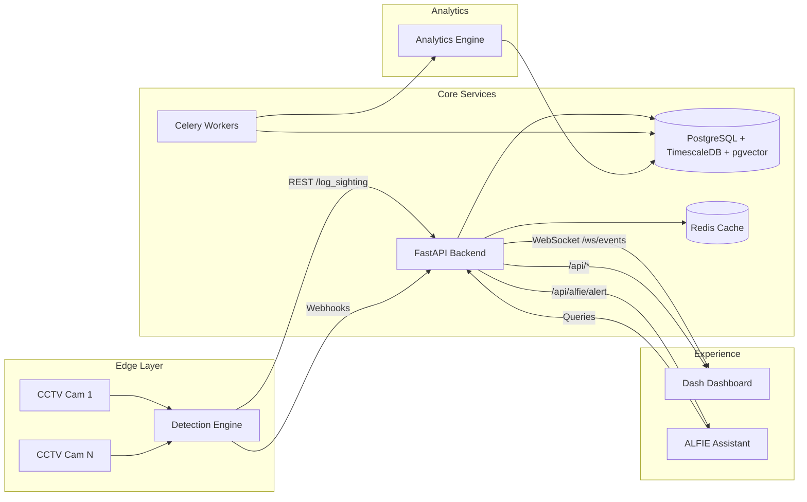

# SentinelForge Architecture Snapshot

```mermaid
flowchart LR
    subgraph Edge[Edge Layer]
        CAM1[CCTV Cam 1]
        CAMN[CCTV Cam N]
        DET[Detection Engine]
        CAM1 --> DET
        CAMN --> DET
    end

    subgraph Core[Core Services]
        API[FastAPI Backend]
        DB[(PostgreSQL + TimescaleDB + pgvector)]
        CELERY[Celery Workers]
        REDIS[(Redis Cache)]
        API --> DB
        API --> REDIS
        CELERY --> DB
        DET -->|REST /log_sighting| API
        DET -->|Webhooks| API
    end

    subgraph Analytics
        ANA[Analytics Engine]
        ANA --> DB
        CELERY --> ANA
    end

    subgraph Experience
        DASH[Dash Dashboard]
        ALFIE[ALFIE Assistant]
        API -->|WebSocket /ws/events| DASH
        API -->|/api/*| DASH
        API -->|/api/alfie/alert| ALFIE
        ALFIE -->|Queries| API
    end
```

> Focus Area: This iteration prioritizes the `DASH` subsystem (frontend) while stubbing upstream dependencies with mock services.
